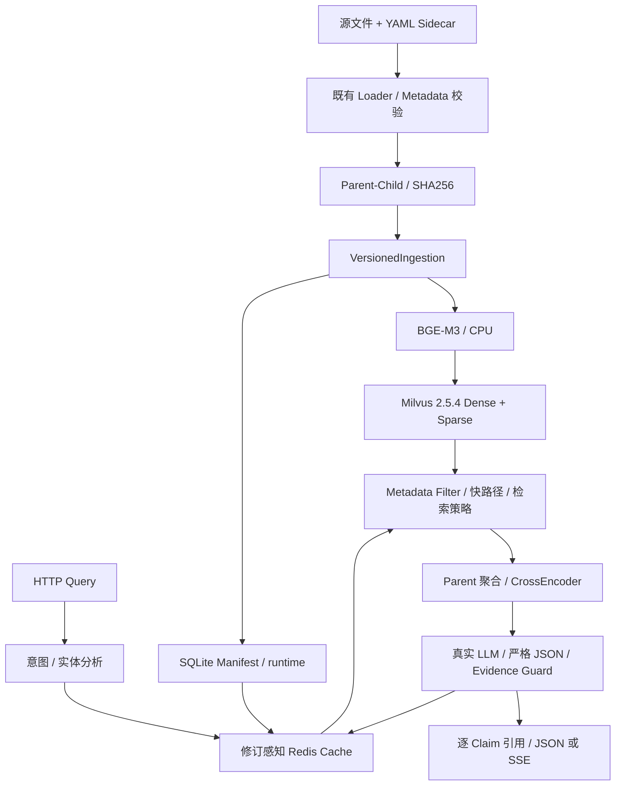

# 制造业设备智能运维 RAG 知识问答系统

面向设备运维、维修和技术人员，将设备资料转换为可按型号、报警码和知识类型检索的证据，再生成带逐条引用的回答。项目复用原 EduRAG 的 Loader、Parent-Child、BGE-M3、Milvus 和 CrossEncoder，正式入口为 `manufacturing_app.py`。

**Stage 0–13: PASS；Migration: COMPLETE；Full Integration Readiness: YES（受控本地集成）。** 2026-10-06 已实际跑通 Docker、文件摄取、真实模型/LLM、JSON/SSE、Redis 缓存及持久化重启。验收语料为 synthetic，未验证真实企业知识库、生产容量、生产 SLA 或安全认证。证据见 [Stage 13 报告](docs/STAGE_REPORTS/STAGE13_REPORT.md)，完整文档见 [索引](docs/README.md)。

## 业务场景与核心能力

- 手册、参数、报警、故障、维保、备件和历史案例的单文档 Metadata 合约。
- YAML Sidecar 校验、SHA256 稳定 Parent/Child 身份、版本 Manifest、增量 Upsert 与 Delta Delete。
- 查询意图/实体分析、硬标识符 Metadata Filter、Dense/Sparse 混合检索、Parent 聚合和重排。
- 已批准语料的报警/FAQ 证据快路径；严格 DIRECT/REWRITE/SUBQUERY 策略。默认 BM25 接受关闭。
- 严格 JSON、本地 Schema 校验、逐 Claim 引用、数字/标识符保护；缺证据返回不足，校验失败返回安全错误。
- FastAPI JSON/SSE、已验证答案流、知识修订感知 Redis TTL 缓存与故障降级。

## 系统架构与端到端调用链



Formal Compose 提供 API、Redis、Etcd、MinIO、Milvus，不需要 MySQL。模型只读挂载，Manifest/日志外置，基础服务使用持久卷。runtime 在 FastAPI lifespan 中初始化；必须先摄取建立 Manifest，再启动 ready API。

## 制造业 Metadata 与入库

每个资料文件配一个同名 Sidecar，例如 `parameter.txt.yaml`：

```yaml
document_id: SYN-DEMO-PARAMETER-001
document_version: "1.0"
title: SYN-DEMO-100 合成参数演示
knowledge_type: parameter
equipment_type: 合成演示设备
equipment_model: SYN-DEMO-100
manufacturer: Synthetic Demo
language: zh-CN
```

这是合成示例。条件必填字段及约束见 [Metadata 合约](docs/MANUFACTURING_METADATA_SCHEMA.md)。一份 Sidecar 对应一个型号/知识类型；多型号资料需先明确拆分语义。

摄取走真实 `VectorStore(schema_mode="manufacturing") → SQLiteManifestStore → VersionedIngestion.ingest_directory()`，复用 Loader/Splitter。首次 `INGEST`；相同文件、Metadata 和处理合约重跑 `SKIP_UNCHANGED`。更新先写新 Child、清理差集，成功后提交 Manifest。单 worker/单 writer，不提供跨 Milvus/SQLite 分布式事务。详见 [版本摄取合约](docs/MANUFACTURING_VERSIONED_INGESTION.md)。

## 检索、Generation / Evidence Guard

正式切分 Parent `512/120`、Child `128/30`（size/overlap）。检索保持 `k=5 / M=2 / Dense=0.8 / Sparse=0.3 / nprobe=10 / BM25 disabled`。原问题分析建立 Filter，改写须保留型号/报警等硬实体，多查询按 Child ID 融合，再做一次原问题 Parent 重排。

生成使用 `response_format=json_object`，再执行本地 Pydantic、证据身份/版本、逐 Claim 引用及数字/标识符 Guard。JSON mode 不能替代本地校验；Guard 不证明语义蕴含或维修操作安全。SSE answer 来自完整验证结果，不是 raw LLM token。

## FastAPI / SSE 与 Redis Cache

| 接口 | 行为 |
| --- | --- |
| `GET /health/live` | 应用存活 |
| `GET /health/ready` | runtime 初始化及 cache 状态；不是实时探测全部依赖 |
| `POST /api/manufacturing/query` | JSON 答案、claims、citations、used_evidence_ids、cache_hit |
| `POST /api/manufacturing/stream` | 未缓存成功路径 start → analysis → retrieval → generation → answer → citations → done |

`session_id` 仅关联请求，不提供 conversation memory。Redis 只缓存 validated answered，Key 为 `manufacturing:answer:v1:<sha256>`，绑定问题/分析、LLM、检索配置和 Manifest/FastPath 修订，有限 TTL 默认 300 秒。Redis 故障仍可走核心问答。详见 [API](docs/MANUFACTURING_API.md)、[Cache](docs/MANUFACTURING_CACHE.md)、[Generation](docs/MANUFACTURING_GENERATION.md)。

## Evaluation Results

Stage 12 **Controlled Synthetic Benchmark / Local CPU / 25 samples / Not Production Quality Claim**：真实 BGE-M3、Milvus 2.5.4、CrossEncoder，42 Child / 21 active document snapshots，同一知识修订的 Direct 与 scripted Strategy。

| 指标 | Direct | Strategy |
| --- | ---: | ---: |
| Parent Hit@2 | 1.0 | 1.0 |
| Parent MRR@2 | 1.0 | 1.0 |
| Document Hit@2 | 1.0 | 1.0 |
| 检索总耗时均值（ms） | 606.205 | 125.811 |

Strategy 是 FastPath-heavy workload（21 次快路径），Child 层只评 4 个样本，Direct 分母 25；不能将差值称作质量提升。时延不含初始化、摄取、HTTP/LLM，不是生产 SLA。真实 LLM Planner 基准准确率和 answer-quality RAGAS **NOT RUN**。完整指标见 [评估说明](docs/MANUFACTURING_EVALUATION.md)、[Paired 结果](docs/evaluation_results.json)、[Stage 12 报告](docs/STAGE_REPORTS/STAGE12_REPORT.md)。Stage 13 两份文件仅用于端到端验收，没有新增质量指标。

## Docker Quick Start（合成演示）

前提：可用 Docker Engine/Compose（overlay 使用 `!reset`；本次实测 Compose v5.5.1）、首次安装固定依赖所需网络、有效 OpenAI-compatible JSON 模型权限、本地已准备的 `rag_qa/models/bge-m3` 和 `bge-reranker-large` 权重。镜像不下载/包含模型权重。没有容量认证，应为模型进程准备足够内存。

从仓库根目录执行；保护已有 `.env`，不存在才复制：

```powershell
if (-not (Test-Path .env)) { Copy-Item .env.example .env }
New-Item -ItemType Directory -Force runtime/stage13/acceptance, runtime/stage13/logs | Out-Null
```

在本地 `.env` 填写自己的 `DASHSCOPE_API_KEY`、`LLM_MODEL`、`DASHSCOPE_BASE_URL`、`REDIS_PASSWORD`、`MINIO_ROOT_USER`、`MINIO_ROOT_PASSWORD`，设置 `APP_PORT=18080`。本次模型 `qwen-plus`，端点为 DashScope OpenAI-compatible；账户需具备相应权限。密码必须自行设置，无 secret fallback。`.env`/`config.ini` 不提交。Linux bind mount 需允许 UID 10001 写 runtime/logs 并读取模型。

```powershell
$stage13Compose = @('compose', '--env-file', '.env', '-p', 'stage13-acceptance', '-f', 'docker-compose.yml', '-f', 'docker-compose.acceptance.yml')
& docker @stage13Compose config --quiet
& docker @stage13Compose build manufacturing-api
& docker @stage13Compose up -d --wait --wait-timeout 180 etcd minio milvus redis
# 先串行摄取，避免 bootstrap 与 API 同时加载两套模型。
& docker @stage13Compose up --no-deps manufacturing-bootstrap
# 首次 INGEST 证据仅保存一次；已有 first 文件时保留。
if (-not (Test-Path runtime/stage13/acceptance/bootstrap_first.json)) {
    Copy-Item runtime/stage13/acceptance/bootstrap.json runtime/stage13/acceptance/bootstrap_first.json
}
& docker @stage13Compose run --no-deps manufacturing-bootstrap python -m scripts.bootstrap_manufacturing_demo --output /app/runtime/bootstrap_second.json
& docker @stage13Compose up -d --no-deps --wait --wait-timeout 240 manufacturing-api
Invoke-RestMethod http://127.0.0.1:18080/health/ready
```

检查每条命令成功再执行下一条。验收使用专用 `manufacturing_rag_acceptance_v1` 和 `runtime/stage13/acceptance/acceptance_manifest.sqlite3`；演示明确 **SYNTHETIC / NOT PRODUCTION FACTS**。正式 Compose 不自动灌演示语料。已有环境复跑会 SKIP；不删除数据或伪造首次 INGEST。不要并行用两个 project 共享此 acceptance runtime。

停止/重启保留卷和 Manifest：

```powershell
& docker @stage13Compose stop
& docker @stage13Compose start
```

禁止 `down -v`。仅 API 绑定本机端口，基础服务没有 host port；生产暴露、TLS、认证及容量需另行设计验证。

## Real Data Ingestion（明确批准的资料）

准备不含演示语料的 `approved_sources/`，每个文件配合法 Sidecar，在 `.env` 选择正式集合和 Manifest。不要将 synthetic 事实当真实设备数据。先基础设施，再真实摄取，成功后启动 API：

```powershell
docker compose --env-file .env config --quiet
docker compose --env-file .env build manufacturing-api
docker compose --env-file .env up -d --wait etcd minio milvus redis
docker compose --env-file .env run --no-deps -v ./approved_sources:/app/approved_sources:ro manufacturing-api python -m scripts.bootstrap_manufacturing_demo --real-data --source-dir /app/approved_sources --output /app/runtime/ingestion.json
docker compose --env-file .env up -d --wait manufacturing-api
```

`--real-data` 表示操作者提供资料，不证明真实性/授权。脚本拒绝将 bundled demo 标记 real-data，默认 demo 拒绝写正式集合。仅串行摄取；管理线上读写一致性边界，Manifest 不是分布式锁。正式项目独立卷，不能复用 acceptance Manifest。

## API Examples

下面 curl 示例在 PowerShell 使用 `curl.exe`：

```bash
curl -H 'Content-Type: application/json' -d '{"query":"设备型号 SYN-DEMO-100 的主轴额定转速是多少？"}' http://127.0.0.1:18080/api/manufacturing/query
curl -N -H 'Content-Type: application/json' -d '{"query":"设备型号 SYN-DEMO-100 的模拟维护周期是多少？"}' http://127.0.0.1:18080/api/manufacturing/stream
```

本次 JSON 合成转速 `1200 rpm` 引用 `SYN-DEMO-PARAMETER-001 / 1.0`；SSE 合成周期 `250 小时` 引用 `SYN-DEMO-MAINTENANCE-001 / 1.0`。引用包含实际 document/version/parent/source。缓存命中 SSE 会省略检索/生成阶段，详见 API 合约。

## Testing

普通测试不自动启动 Docker 或请求 LLM；测试依赖 `requirements-dev.txt`，完整运行依赖 `requirements.txt`：

```powershell
python -m pytest tests -q -rs --tb=short
python -m pytest tests/test_stage0_smoke.py -q -rs
```

本次轻量 validation 环境：**1026 passed / 0 failed / 13 skipped**。Skip 涉及缺完整 Legacy/ML 依赖及未启用 Stage 3/12 Live，不是集成通过。真实 Stage 13 另在 Docker Python 3.10.20/full requirements 环境执行。

完成首次/二次 bootstrap 并启动 API 后，本机 Python 执行独立 stdlib 验收：

```powershell
$env:STAGE13_LIVE = '1'
python -m scripts.stage13_acceptance --env-file .env --lifecycle
Remove-Item Env:STAGE13_LIVE
```

`--lifecycle` 明确测试隔离项目 Redis 停机恢复、API 重启、整栈 stop/start，不删除卷。测试前不要先向同一 API 发送两个验收问题，以免干扰 miss→hit；复跑保留首次摄取记录并等待 TTL 过期。结果写 ignored runtime。公开证据见 [在线验收](docs/stage13_acceptance_results.json) 和 [镜像/环境核验](docs/stage13_integration_verification.json)。

## Known Limitations

- 数据集与 Demo 均 synthetic；真实企业效果需 approved dataset，Production Quality Certification / Production Scale Validation 均 NO。
- 单 writer；无 distributed ingestion transaction、multi-worker ingestion 或线上原子读写快照。
- session_id 不是 conversation memory；没有制造业前端、生产认证、租户隔离或 TLS 认证交付。
- 数字/标识符 Guard 不证明语义蕴含、操作安全或 Prompt Injection 免疫；缓存信任合法 writer 与受保护 Redis。
- readiness 主要表示 runtime 初始化；后续依赖故障可能在请求中返回固定错误码。 Milvus 停机抽测超过 150 秒 HTTP 等待，未验证其生产故障响应 deadline。
- RAGAS judge NOT RUN；模型权限、网络和 timeout 影响运行，不用 fake LLM 替代失败。
- Milvus 2.4.10 nullable 不兼容历史保留；正式锁定 2.5.4。默认检索配置保持，没有生产调参。

## Project History / Legacy Boundary

`app.py` / `new_main.py` 是 Legacy EduRAG 历史入口，涉及教育分类、MySQL/旧 Redis、WebSocket 和教育前端；源码/资料保留，不作为制造业默认 Docker CMD。制造业本机入口 `python -m uvicorn manufacturing_app:app --host 127.0.0.1 --port 8080`，需同样的依赖、模型、环境和已初始化 Manifest，Ctrl+C 停止。

直接 Python 不自动读取 `.env`：进程环境 > `config.ini` > fallback；Compose 显式注入环境，两者有区别。[当前架构](docs/CURRENT_ARCHITECTURE.md)、[历史清单](docs/EDURAG_LEGACY_INVENTORY.md)、[阶段计划](docs/MANUFACTURING_MIGRATION_PLAN.md) 和 Stage 报告保留逐阶段事实及当时限制。[AGENTS.md](AGENTS.md) 约束维护及自动 Commit/Push/远端核验；本次完成后停止，不创建 Stage 14。
